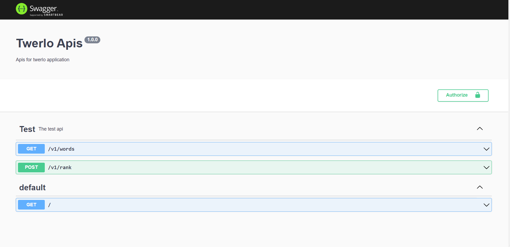

# Twerlo

## Installation

### Platform & tools

You need to install Node.js and then the development tools. Node.js comes with a package manager called [npm](http://npmjs.org) for installing NodeJS applications and libraries.
* [Install node.js](http://nodejs.org/download/) (requires node.js version >= 12.13.0)
* Install global npm : 
   ```
    npm install -g 
    ```
### Get the Code

Either clone this repository or fork it on GitHub and clone your fork:

```
git clone https://github.com/mustafaabdelbadea/Twerlo.git
cd twerlo
```

### Server side

```
cd server
```

### Application dependencies

Our application is a NodeJS application that relies upon some 3rd Party npm packages.  You need to install these:

* Install local dependencies (from the project root folder):

    ```
    npm install
    ```

  (This will install the dependencies declared in the ./package.json file)

## Running
### Start the Server
* Run the server

    ```
    npm run dev
    ```
* Browse to the application at Port(8080) [http://localhost:8080]

* Run on Docker container 
    ```
    npm run docker-run
    ```

### Client side

```
cd client
```

### Application dependencies

Our application is a NodeJS application that relies upon some 3rd Party npm packages.  You need to install these:

* Install local dependencies (from the project root folder):

    ```
    npm install
    ```

  (This will install the dependencies declared in the ./package.json file)

## Running
### Start the Client side

* Run the server

    ```
    npm start
    ```
* Browse to the application at Port(4200) [http://localhost:4200]

* Run on Docker container 
    ```
    npm run docker-run
    ```

    
### Start Server and Client side

* Run on Docker container 
    ```
    npm run docker-run-full
    ```

## Testing

 - Mocha testing for test server apis
 - Make sure there is .env.test file

 * Test 
    ```
    cd server
    npm run test
    ```


## Endpoints Rest apis

* Visit
     ```
    localhost:8080/v1/api-docs
     ```



## How to use

    * Choose the right answer from the list
    * After compelete choosing click next to get Rank and Score
    * You can try again by clicking on try again button in the rank page
